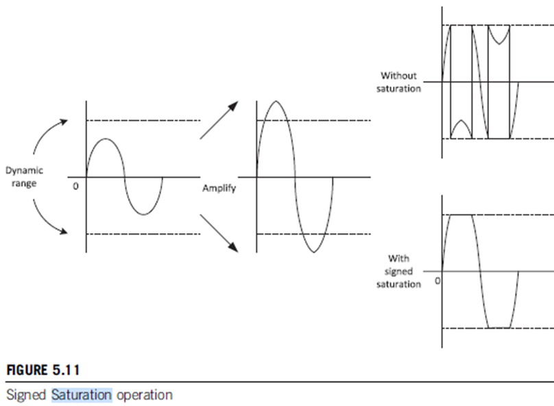
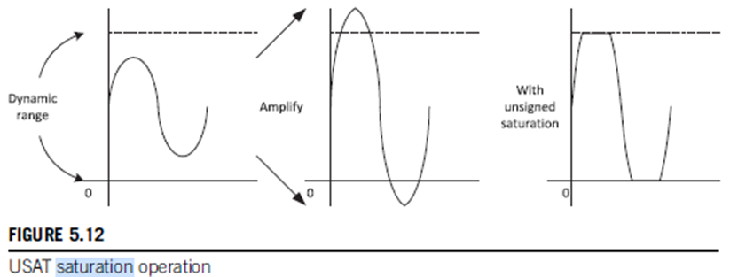

Arquitectura de Microprocesadores
Carrera de Especialización en Sistemas Embebidos
Alumno: Mansilla Rubén Darío (Co20 CESE)
Docentes: Santiago Germino
          Denis Genero

Preguntas Orientadoras

Desarrollo
1. La familia de microprocesadores / microcontroladores de ARM está agrupada en tres tipos:
1.1. Cortex A (Application): Esta familia está conformada por microprocesadores de Aplicación, de donde toma la sigla A. 
Constituida por microprocesadores de alto rendimiento orientados a soportar sistemas operativos embebidos de alta 
performance, y alto nivel de paralelismo. 

Características principales:
    • Contienen varios núcleos de alta frecuencia, del orden de los GHz.
    • Tienen integrada mucha memoria RAM del orden de los GB.
    • Tienen mucha memoria caché
Aplicaciones: Nintendo switch con las siguientes características:
    • 4 Cortex A-57 trabajando a 1GHz
    • 4 Cortex A-53 trabajando a 1,3 GHz
    • 4 GB de memoria RAM LPDDR4

1.2. Cortex R (Realtime): Esta familia está conformada por microprocesadores orientados a soportar sistemas de tiempo real 
donde se necesita implementar soluciones de baja. latencia, alta predictibilidad y elevada capacidad de cómputo. Por estas 
características se utilizan en sistemas críticos, como por ejemplo: sistemas de control para automóviles ( control de 
tracción, de frenos, ets), dispositivos médicos críticos, dispositivos industriales críticos, etc.

1.3. Cortex M (Microcontroller): Son microcontroladores orientados a dispositivos de uso masivo y sistemas embebidos 
compactos. Están diseñados para soportar alta densidad de código y ser programados en C.
Los más conocidos son:
    • Cortex M0/M0+: Pensados para una implementación mínima de bajo consumo y bajo costo.
    • Cortex M3/M4/M7: Suman mayor performance, más funcionalidades (división por hardware), FPU (Unidad de Punto Flotante), 
      MPU (Unidad de Protección de memoria), etc.
Ejemplos en placas de desarrollo:

    Raspberry Pi Pico: Cortex M0+
    PSOC5LP: Cortex M3
    STM32-Nucleo F429ZI: Cortex M4
    STM32-Nucleo F676ZI: Cortex M7	

Cortex M
1. Diferencias entre las familias de procesadores de ARM:

# Cortex M0 y M0+
    • Tienen arquitectura ARMv6-M
    • La mayoría soporta instrucciones Thumb (16 bits)
    • Algunos soportan Thumb-2 (32 bits)
    • Tienen multiplicación por hardware de 32 bits
    • No tienen división por hardware
    • No tienen solución “saturated math”
    • No contienen extensión DSP (procesamiento de señales digitales)
    • No incluyen FPU (Unidad de Punto Flotante)
# Cortex M3
    • Tienen arquitectura ARMv7-M
    • Todos soportan instrucciones Thumb (16 bits)
    • Todos soportan Thumb-2 (32 bits)
    • Tienen multiplicación por hardware de 32 bits o 64 bits
    • Tienen división por hardware
    • Tienen solución “saturated math”
    • No contienen extensión DSP (procesamiento de señales digitales)
    • No incluyen FPU (Unidad de Punto Flotante)
# Cortex M4
    • Tienen arquitectura ARMv7E-M
    • Todos soportan instrucciones Thumb (16 bits)
    • Todos soportan Thumb-2 (32 bits)
    • Tienen multiplicación por hardware de 32 bits o 64 bits
    • Tienen división por hardware
    • Tienen solución “saturated math”
    • Contienen extensión DSP (procesamiento de señales digitales)
    • Opcionalmente (SP) incluyen FPU (Unidad de Punto Flotante)
# Cortex M7
    • Tienen arquitectura ARMv7E-M
    • Todos soportan instrucciones Thumb (16 bits)
    • Todos soportan Thumb-2 (32 bits)
    • Tienen multiplicación por hardware de 32 bits o 64 bits
    • Tienen división por hardware
    • Tienen solución “saturated math”
    • Contienen extensión DSP (procesamiento de señales digitales)
    • Opcionalmente (SP & DP) incluyen FPU (Unidad de Punto Flotante)

2. El set de instrucciones Thumb permite una mayor densidad de código en comparación con el set de instrucciones ARM 
tradicional, debido a que las instrucciones Thumb son instrucciones de 16 bits, mientras que las instrucciones ARM son 
de 32 bits. Esto puede ser beneficioso en términos de ahorro de memoria y aumento de la velocidad de transferencia de las 
instrucciones al microprocesador, aunque puede tener limitaciones en cuanto a la complejidad de las operaciones que se pueden 
realizar ya que necesitaría mas instrucciones thumb para resolver algunas tareas mas complejas.

3. La arquitectura load-store es un tipo de arquitectura en la que solo se pueden realizar operaciones de carga (load) y 
almacenamiento (store) entre la memoria y los registros, mientras que las operaciones aritméticas se realizan exclusivamente 
entre registros.
En una arquitectura load-store, las instrucciones de carga (load) se utilizan para transferir datos desde la memoria a los 
registros, mientras que las instrucciones de almacenamiento (store) se utilizan para transferir datos desde los registros a 
la memoria.
Este tipo de arquitectura no permite realizar operaciones aritméticas directamente entre la memoria y los registros. Por lo 
tanto, las instrucciones que implican operaciones aritméticas con operandos en la memoria, como por ejemplo "add" (suma) o 
"sub" (resta), no están disponibles en una arquitectura load-store.
En resumen, una arquitectura load-store es aquella en la que las operaciones de carga y almacenamiento se realizan entre la 
memoria y los registros, mientras que las operaciones aritméticas se realizan exclusivamente entre registros.

4. El mapa de memoria de la familia ARM varía dependiendo del modelo específico y la implementación de la arquitectura. Sin 
embargo, en términos generales, la familia ARM utiliza una estructura de memoria en la que se divide el espacio de direcciones 
en diferentes regiones.
A modo de descripción general del mapa de memoria típico de la familia ARM, podemos considerar la siguiente subdivisión de 
regiones:
    • Zona de código (Code Section): Esta zona se utiliza para almacenar el código ejecutable, como las instrucciones del 
      programa y las constantes. Es una región de solo lectura (read-only) y suele estar ubicada en la parte inferior del 
      espacio de direcciones.
    • Zona de datos (Data Section): Esta zona se utiliza para almacenar los datos del programa, como variables globales y 
      estáticas. Puede ser de lectura y escritura (read-write) y suele estar ubicada en la parte superior del espacio de 
      direcciones.
    • Pila (Stack): La pila se utiliza para almacenar las variables locales y los registros de activación de las funciones. 
      Generalmente crece hacia abajo en la memoria y se encuentra en la parte superior del espacio de direcciones.
    • Montón (Heap): El montón se utiliza para almacenar datos dinámicos, como objetos o estructuras de datos creados en 
      tiempo de ejecución. Generalmente crece hacia arriba en la memoria y se encuentra en la parte inferior del espacio de 
      direcciones.
    • Además de estas regiones principales, también puede haber otras regiones en el mapa de memoria, como zonas reservadas 
      para el sistema operativo, controladores de dispositivos, tablas de vectores de interrupción, entre otros.
|------------------------------------|
|        Zona de código (ROM)        |
|------------------------------------|
|        Zona de código (RAM)        |
|------------------------------------|
|        Zona de datos (RAM)         |
|------------------------------------|
|               Pila                 |
|------------------------------------|
|               Montón               |
|------------------------------------|
|        Zona de dispositivos        |
|------------------------------------|     
|          Zona de sistema           |
|------------------------------------|

5. El uso de "shadowed pointers" (punteros en sombra) en el PSP (Process Stack Pointer) y el MSP (Main Stack Pointer) en la 
arquitectura ARM presenta varias ventajas:
    • Seguridad: Los "shadowed pointers" permiten tener una copia de seguridad de los punteros de pila principales (PSP y MSP). 
      Esto es útil en caso de que se produzca un desbordamiento de pila o un error en el programa, ya que se puede acceder a 
      la copia en sombra para recuperar la integridad del sistema.
    • Protección contra overflow (desbordamiento) de pila: El uso de "shadowed pointers" puede ayudar a detectar y proteger 
      contra desbordamientos de pila. Si se produce un overflow en el PSP o el MSP, la copia en sombra se mantendrá intacta y 
      se podrá utilizar para detectar el overflow y tomar medidas correctivas.
    • Facilidad de depuración: Al tener una copia en sombra de los punteros de pila, se facilita la depuración de errores 
      relacionados con la pila. Se pueden utilizar herramientas de depuración para comparar los valores de los punteros en 
      sombra con los valores actuales y detectar cualquier discrepancia o anomalía.
    • Recuperación de errores: En caso de que se produzca un error crítico en el programa y se pierda la integridad de los 
      punteros de pila principales, los "shadowed pointers" pueden utilizarse para recuperar el sistema y restaurar los valores 
      correctos de los punteros de pila.
En resumen, el uso de "shadowed pointers" en el PSP y el MSP proporciona una capa adicional de seguridad y protección contra 
desbordamientos de pila, facilita la depuración de errores relacionados con la pila y permite la recuperación del sistema en 
caso de errores críticos.

6. El procesador Cortex-M de ARM utiliza un modelo de seguridad basado en modos de privilegio y operación para garantizar la 
protección y el aislamiento entre diferentes niveles de software. Los modos de privilegio y operación en el Cortex-M son los 
siguientes:
    • Modo Handler (Privilegiado): Este modo es el más alto en términos de privilegios y se utiliza para ejecutar rutinas de 
      manejo de excepciones y eventos, como interrupciones y excepciones de sistema. En este modo, se tiene acceso completo a 
      todas las instrucciones y registros del procesador.
    • Modo Thread (Privilegiado): Este modo se utiliza para la ejecución de tareas normales del programa. En este modo, se 
      tiene acceso completo a todas las instrucciones y registros del procesador.
    • Modo Unprivileged (No privilegiado): Este modo es el de menor privilegio y se utiliza para ejecutar tareas con 
      restricciones de seguridad. En este modo, se restringe el acceso a ciertas instrucciones y registros del procesador, 
      lo que ayuda a proteger el sistema operativo y las aplicaciones de software de posibles amenazas.
La conmutación entre los diferentes modos de privilegio y operación se realiza mediante el cambio de bits específicos en el 
registro de estado (PSR) del procesador. El bit de Control (CONTROL) en el PSR se utiliza para habilitar o deshabilitar el 
cambio de modo privilegiado a no privilegiado y viceversa.
A continuación, se describe un ejemplo de cómo se pasa del modo privilegiado al no privilegiado y nuevamente al modo 
privilegiado:
    • Inicialmente, el procesador se encuentra en el modo privilegiado (Modo Handler o Modo Thread).
    • Se ejecuta una instrucción que cambia el bit de Control en el PSR para habilitar el modo no privilegiado.
    • A partir de ese momento, el procesador se encuentra en el modo no privilegiado, donde se restringe el acceso a ciertas 
      instrucciones y registros.
    • Durante la ejecución en el modo no privilegiado, se produce una excepción o interrupción.
    • El procesador cambia automáticamente al modo privilegiado (Modo Handler) para manejar la excepción o interrupción.
    • Una vez finalizada la rutina de manejo de excepciones, se ejecuta una instrucción que cambia nuevamente el bit de 
      Control en el PSR para habilitar el modo privilegiado.
    • A partir de ese momento, el procesador se encuentra nuevamente en el modo privilegiado (Modo Handler o Modo Thread).
No se puede regresar directamente del modo no privilegiado al modo privilegiado. Si se desea hacerlo, se debe disparar una 
interrupción o excepción que saque al sistema del modo no privilegiado y lo lleve al modo Handler (privilegiado); sólo 
estando en un modo privilegiado se puede cambiar el bit de control de PSR para habilitar el modo privilegiado. 

7. Se dice que la arquitectura ARM cuenta con un modelo de registros ortogonal porque la configuración de cada registro no 
interfiere en la del otro. El contenido de cada registro no afecta al contenido del otro. Por ejemplo, cuando se utiliza un 
sistema operativo embebido, el registro CONTROL podría re programarse en cada cambio de contexto para permitir que algunas 
tareas de la aplicación se ejecuten con un nivel de acceso privilegiado y otras se ejecuten con un nivel de acceso sin 
privilegios.
Decimos que las configuraciones de nPRIV y SPSEL son ortogonales, dado que son posibles cuatro combinaciones diferentes de 
nPRIV y SPSEL, aunque sólo tres de ellas se usan comúnmente en aplicaciones del mundo real.
En la mayoría de las aplicaciones simples sin un sistema operativo embebido, no es necesario cambiar el valor del registro 
CONTROL. Toda la aplicación puede ejecutarse en un nivel de acceso privilegiado y utilizar únicamente el MSP.


8. Las instrucciones de ejecución condicional (IT, por sus siglas en inglés) son una característica de la arquitectura ARM 
que permite ejecutar instrucciones condicionalmente en función del estado de las banderas o flags del procesador. Estas 
instrucciones ofrecen varias ventajas, entre las que se incluyen:
    • Reducción del tamaño del código: Las instrucciones condicionales permiten ejecutar diferentes instrucciones en función 
      de una condición, lo que puede eliminar la necesidad de escribir múltiples bloques de código separados. Esto reduce el 
      tamaño del código y facilita su mantenimiento.
    • Mejora del rendimiento: Al ejecutar instrucciones condicionalmente, se pueden evitar saltos o desvíos innecesarios, lo 
      que puede mejorar el rendimiento del programa al reducir la cantidad de ciclos de reloj necesarios para ejecutarlo.
    • Mayor flexibilidad: Las instrucciones condicionales permiten adaptar el flujo de ejecución del programa según diferentes 
      condiciones, lo que brinda una mayor flexibilidad en el diseño del software. Esto puede ser especialmente útil en casos 
      donde se necesitan tomar decisiones basadas en múltiples condiciones.
    • Optimización del código: Al utilizar instrucciones condicionales, el compilador puede realizar diferentes optimizaciones, 
      como la eliminación de código muerto o la reorganización de instrucciones para aprovechar al máximo el pipeline del 
      procesador.
Un ejemplo de uso de instrucciones de ejecución condicional en ARM sería:
```
	CMP R0, #0    ; Compara el valor de R0 con 0
	ITE GT        ; Ejecuta las siguientes dos instrucciones si R0 es mayor que 0
	MOVGT R1, #1  ; Si R0 > 0, mueve el valor 1 a R1
	MOVLE R1, #0  ; Si R0 <= 0, mueve el valor 0 a R1
```
En este ejemplo, se compara el valor de R0 con 0 y, dependiendo del resultado de la comparación, se ejecutan diferentes 
instrucciones. Si R0 es mayor que 0, se mueve el valor 1 a R1. Si R0 es menor o igual a 0, se mueve el valor 0 a R1. Esto 
permite tomar diferentes acciones en función de una condición específica.

9. Describa brevemente las excepciones más prioritarias (reset, NMI, Hardfault):
•	El Reset es un tipo especial de excepción. Cuando el procesador sale de un reset, ejecuta el handler de reinicio en modo Thread (en lugar del modo Handler como en otras excepciones). Además, el número de excepción en IPSR se lee como cero.
Un reset pone al PC apuntando a la dirección 00000H. Tenemos dos maneras de hacer esto: 
1.	Hard Reset: Desenergizar el micro y arrancar de nuevo.
2.	Soft Reset: Poner el PC al valor 00000H.
Es el tipo de excepción de mas alto nivel de prioridad: -3
•	NMI Interrupción No Enmascarable. Es la segunda excepción de mas alta prioridad después de reset: -2
Como su nombre lo indica, no puede ser deshabilitada por software. Suele ser implementada por el fabricante. Un ejemplo es el watchdog que genera un NMI que provoca un reset.
Reservada para el control del sistema: como fallas en el sistema de clock, inicialización de la flash, etc.
•	Hard Fault: Todas las clases de fallas, cuando el Handler de fallas correspondiente no se puede activar porque actualmente está deshabilitado o enmascarado por un enmascaramiento de excepciones.
Varios tipos de excepciones en los procesadores Cortex-M3 y Cortex-M4 son excepciones de manejo de fallas. Las excepciones de falla se activan cuando el procesador detecta un error, como la ejecución de una instrucción no definida, o cuando el sistema de bus devuelve una respuesta de error a un acceso a la memoria. El mecanismo de excepción de fallas permite que los errores se detecten rápidamente y potencialmente permite que el software lleve a cabo acciones correctivas 
De forma predeterminada, la falla de bus, la falla de uso y la falla de administración de memoria están deshabilitadas y todos los eventos de falla desencadenan la excepción HardFault. Sin embargo, las configuraciones son programables y puede habilitar las tres excepciones de falla programables individualmente para manejar diferentes tipos de fallas. La excepción HardFault siempre está habilitada.
Uso típico para Uso indebido de memoria dinámica, incorrecta inicialización de periféricos.
10. Describa las funciones principales de la pila. ¿Cómo resuelve la arquitectura el llamado a funciones y su retorno?
Como en casi todas las arquitecturas de procesador, los procesadores Cortex-M necesitan memoria de Stack (pila) para funcionar y tienen punteros de pila (R13). La pila es un tipo de mecanismo de uso de memoria que permite que una parte de esta se utilice como búfer de almacenamiento de datos de tipo LIFO (último en entrar - primero en salir). Los procesadores ARM utilizan la memoria principal del sistema para operaciones de memoria de pila y tienen la instrucción PUSH para almacenar datos en la pila y la instrucción POP para recuperar datos de la pila. El puntero de pila seleccionado actualmente se ajusta automáticamente para cada operación PUSH y POP.
La pila se puede utilizar para:
• Almacenamiento temporal de datos originales cuando una función que se está ejecutando necesita utilizar registros (en el banco de registros) para el procesamiento de datos. Los valores se pueden restaurar al final de la función para que el programa que llamó a la función no pierda sus datos.
• Paso de información a funciones o subrutinas.
• Para almacenar variables locales.
• Para mantener el estado del procesador y registrar valores en caso de excepciones como una interrupción.
Los procesadores Cortex-M utilizan un modelo de memoria de pila llamado “full-descending stack” (pila descendente completa). Cuando se inicia el procesador, el SP se configura al final del espacio de memoria reservado para la memoria de la pila. Para cada operación PUSH, el procesador primero disminuye el SP y luego almacena el valor en la ubicación de memoria señalada por el SP. Durante las operaciones, el SP apunta a la ubicación de la memoria donde se enviaron los últimos datos a la pila.
En una operación POP, se lee el valor de la ubicación de memoria señalada por SP y luego el valor de SP se incrementa automáticamente.
Los usos más comunes de las instrucciones PUSH y POP son saber el contenido de los bancos de registros cuando se realiza una llamada a una función o subrutina. Al comienzo de la llamada a la función, el contenido de algunos de los registros se puede guardar en la pila usando la instrucción PUSH y luego restaurar a sus valores originales al final de la función usando la instrucción POP. Tenga en cuenta que para cada operación PUSH (almacenar en la memoria), debe haber un POP (lectura de la memoria) correspondiente y la dirección del POP debe coincidir con la de la operación PUSH.
Cada instrucción PUSH y POP puede transferir múltiples datos hacia/desde la memoria de la pila. Dado que los registros en el banco de registros son de 32 bits, cada transferencia de memoria se genera mediante transferencias de stack PUSH y stack POP y transfiere al menos 1 palabra (4 bytes) de datos y las direcciones siempre están alineadas con límites de 4 bytes. Los dos bits más bajos del SP siempre son cero.
11. Describa la secuencia de reset del microprocesador.
Lo primero que se hace el micro es inicializar el Stack Pointer y luego el Program Counter (PC) apunta al vector de Reset que se encuentra en la dirección 00000H. En la dirección del vector de Reset se encuentra la dirección a la primera instrucción del programa, es decir carga el PC con la dirección de inicio en memoria de código y comienza la ejecución del programa.
12. ¿Qué entiende por “core peripherals”? ¿Qué diferencia existe entre estos y el resto de los periféricos?
Los “core peripherals” serían los periféricos integrados en el mismo core del micro, como por ejemplo: el NVIC (Contorlador de Vectores de Interrupciones Anidadas), La FPU (Unidad de Punto Flotante), la MPU (Unidad e Protección de Memoria), el Systick Timer (Timer del sistema).

13. ¿Cómo se implementan las prioridades de las interrupciones? Dé un ejemplo
La arquitectura ARM Cortex-M cuenta con un controlador de interrupciones llamado NVIC (Controlador de interrupciones vectorizado anidado) que admite hasta 240 solicitudes de interrupción y de 8 a 256 niveles de prioridad de interrupción (dependiendo de la implementación real del dispositivo).
Básicamente se le asigna un nivel de prioridad a las interrupciones del sistema que la otorgan un nivel de privilegio de acceso a los recursos el micro, de tal manera que las de mayor prioridad tomarán el control de la CPU, mientras que las de menor prioridad deberán esperar a que las de mayor privilegio desocupen la misma. Los niveles de privilegio tienen números, siendo los de menor valor numérico los de mas alta prioridad, siendo las mas privilegiadas , de valores negativos.
Por ejemplo, nivel -3 mas alta prioridad, luego nivel -2… nivel 0… nivel 5 y así sucesivamente descendiendo en su nivel de prioridad a media que aumenta su valor numérico.
Vimos ejemplo de las mas prioritarias: Reset, NMI y Hard Fault.
14. ¿Qué es el CMSIS? ¿Qué función cumple? ¿Quién lo provee? ¿Qué ventajas aporta?
El CMSIS (Cortex Microcontroller Software Interface Standard) es una capa de software que proporciona una interfaz estándar para el desarrollo de sistemas embebidos basados en la arquitectura ARM Cortex-M. Fue desarrollado por ARM Holdings para facilitar el desarrollo de software y la portabilidad entre diferentes microcontroladores Cortex-M.
La función principal del CMSIS es servir de base para el desarrollo de una capa de abstracción de hardware (HAL) que permite a los desarrolladores acceder de manera uniforme a los periféricos y funciones del microcontrolador, independientemente del fabricante o modelo específico del chip. Esto simplifica el desarrollo de software y facilita la portabilidad del código entre diferentes microcontroladores Cortex-M.
El CMSIS es proporcionado por ARM Holdings, la empresa que desarrolla la arquitectura ARM. que ofrece el CMSIS como una biblioteca de software de código abierto que los desarrolladores pueden utilizar de forma gratuita.

Las ventajas del CMSIS incluyen:

•	1. Portabilidad: Permite que el código escrito para un microcontrolador Cortex-M se pueda reutilizar fácilmente en otros microcontroladores Cortex-M, lo que facilita la migración entre diferentes chips y fabricantes.
•	2. Eficiencia: Proporciona una capa de abstracción de hardware optimizada que permite un acceso eficiente a los periféricos del microcontrolador, maximizando el rendimiento y la eficiencia del sistema.
•	3. Estándares: Define una interfaz estándar para el desarrollo de software en microcontroladores Cortex-M, lo que facilita la colaboración entre diferentes desarrolladores y empresas.
•	4. Soporte de herramientas: El CMSIS es compatible con una amplia variedad de herramientas de desarrollo, como compiladores, depuradores y entornos de desarrollo integrados (IDE), lo que facilita la integración y el flujo de trabajo en el desarrollo de software.
En resumen, el CMSIS es una capa de software que proporciona una interfaz estándar para el desarrollo de sistemas embebidos basados en la arquitectura ARM Cortex-M. Facilita el desarrollo de software, la portabilidad del código y mejora la eficiencia del sistema. Es proporcionado por ARM Holdings como una biblioteca de software de código abierto.

15. Cuando ocurre una interrupción, asumiendo que está habilitada ¿Cómo opera el microprocesador para atender a la subrutina correspondiente? Explique con un ejemplo
Cuando ocurre una interrupción y esta es atendida la CPU realiza un cambio de contexto. Para hacer esto se produce lo que se denomina un stacking, que consiste en salvar los contenidos de determinados registros de la CDU en el stack, como ser: los registros r0 a r3, r12, ), el LR, Return address, xPSR (por defecto), el registro de estado o APSR (Application Program Status Register), que contienen la info necesaria para regresar al contexto anterior luego de atender la interrupción. También se pueden salvar registros adicionales, si se considera necesario, pero esto, debe hacerse en forma manual por parte del usuario.

16. ¿Cómo cambia la operación de stacking al utilizar la unidad de punto flotante?
En este caso se salvan más registros durante el stacking: aparte de los mencionados en el punto anterior se slavan so registros s0 a s15, el FPSCR, y opcionalmente otros que el usuario considere necesario salvar.

17. Explique las características avanzadas de atención a interrupciones: tail chaining y late arrival.
# Interrupción de tipo tail chaining
Cuando se produce una excepción pero el procesador está manejando otra excepción de la misma o mayor prioridad, la excepción entrará en el estado pendiente. Cuando el procesador termina de ejecutar el controlador de excepciones actual, puede proceder a procesar la solicitud de excepción/interrupción pendiente. En lugar de restaurar los registros de la pila (desapilar) y luego empujarlos nuevamente a la pila (apilar), el procesador omite los pasos de desapilado y apilamiento e ingresa al controlador de excepciones de la excepción pendiente lo antes posible. De esta manera, la brecha de tiempo entre los dos manejadores de excepciones se reduce considerablemente. Para un sistema de memoria sin estado de espera, la latencia de la cadena de cola es de sólo seis ciclos de reloj.
La optimización del encadenamiento de cola también hace que el sistema sea más eficiente energéticamente porque reduce la cantidad de accesos a la memoria de la pila y cada transferencia de memoria consume energía.
# Interrupción tipo late arrival
Cuando se produce una excepción, el procesador acepta la solicitud de excepción e inicia la operación de apilamiento. Si durante esta operación de apilamiento se produce otra excepción de mayor prioridad, la excepción de llegada tardía de mayor prioridad será atendida primero.
Por ejemplo, si la Excepción n.° 1 (prioridad más baja) tiene lugar unos ciclos antes de la Excepción n.° 2 (prioridad más alta), el procesador se comportará como se muestra en la Figura 8.13, de modo que el Controlador n.° 2 se ejecute tan pronto como se complete el stacking.

18. ¿Qué es el systick? ¿Por qué puede afirmarse que su implementación favorece la portabilidad de los sistemas operativos embebidos?
Los procesadores Cortex -M3 y Cortex-M4 están diseñados para admitir sistemas operativos integrados de manera eficiente. Tienen un temporizador del sistema incorporado tipo tick llamado SysTick, que se puede configurar para generar interrupciones periódicas del temporizador para la temporización del sistema operativo. Dado que el temporizador SysTick está disponible en todos los dispositivos Cortex-M3 y Cortex-M4, el código fuente del sistema operativo integrado se puede utilizar fácilmente en todos estos dispositivos sin modificaciones para los temporizadores específicos del dispositivo, por este motivo es que podemos afirmar que favorece la protabilidad de los sistemas operativos embebidos.

19. ¿Qué funciones cumple la unidad de protección de memoria (MPU)?
La MPU es una característica opcional disponible en los procesadores Cortex -M3 y Cortex-M4. Los proveedores de microcontroladores pueden decidir si incluyen la MPU o no. La MPU es un dispositivo programable que monitorea las transacciones del bus y debe configurarse mediante software, generalmente un sistema operativo integrado. Si se incluye una MPU, las aplicaciones pueden dividir el espacio de memoria en varias regiones y definir los permisos de acceso para cada una de ellas. Cuando se viola una regla de acceso, se genera una excepción de falla y el handler de excepciones de falla podrá analizar el problema y, si es posible, corregirlo.
La MPU se puede utilizar de varias maneras. En escenarios comunes, un sistema operativo puede configurar la MPU para proteger los datos utilizados por el kernel del sistema operativo y otras tareas privilegiadas, evitando que programas de usuarios que no son de confianza los corrompan. Opcionalmente, el sistema operativo también puede aislar regiones de memoria entre diferentes tareas de usuario. Estas medidas permiten una mejor detección de fallas del sistema y permiten que los sistemas sean más sólidos en el manejo de condiciones de error.
La MPU también se puede utilizar para hacer que las regiones de la memoria sean de solo lectura, para evitar el borrado accidental de datos en SRAM o la sobreescritura del código de instrucción.
De forma predeterminada, la MPU está deshabilitada y las aplicaciones que no requieren una función de protección de memoria no tienen que inicializarla.

20. ¿Cuántas regiones pueden configurarse como máximo? ¿Qué ocurre en caso de haber solapamientos de las regiones? ¿Qué ocurre con las zonas de memoria no cubiertas por las regiones definidas?

La MPU es una unidad programable que define los permisos de acceso para varias regiones de la memoria. La MPU del procesador Cortex-M3 y Cortex-M4 admite ocho regiones programables y se puede utilizar con un sistema operativo integrado para proporcionar un sistema robusto.
En caso de que alguna aplicación intente acceder a una zona de memoria protegida se puede desencadenar una de dos excepciones:
● HardFault
● MemManege (si se habilita)

21. ¿Para qué se suele utilizar la excepción PendSV? ¿Cómo se relaciona su uso con el resto de las excepciones? Dé un ejemplo

Es una excepción que suele utilizar un sistema operativo en procesos como el cambio de contexto. 
Para algunas otras excepciones del sistema como NMI, PendSV y SysTick, se pueden activar configurando el estado pendiente en Control de interrupciones y Registro de estado (consulte ICSR en la sección 7.9.2). De manera similar a las interrupciones, establecer el estado pendiente de estas excepciones no siempre garantiza que se ejecutarán de inmediato.
Las excepciones SVC y PendSV: son dos tipos de excepciones esenciales para las operaciones de los sistemas operativos integrados, como la implementación del cambio de contexto.
PendSV (llamada de servicio pendiente) es otro tipo de excepción que es importante para respaldar las operaciones del sistema operativo. Es tipo de excepción 14 y tiene un nivel de prioridad programable. La excepción PendSV se activa estableciendo su estado pendiente escribiendo en el Registro de Estado y de Control de Interrupciones (ICSR). A diferencia de la excepción SVC, no es precisa. Por lo tanto, su estado pendiente se puede establecer dentro de un controlador de excepciones de mayor prioridad y ejecutarse cuando finalice el controlador de mayor prioridad.
Usando esta característica, podemos programar el controlador de excepciones PendSV para que se ejecute después de que se hayan realizado todas las demás tareas de procesamiento de interrupciones, asegurándonos de que PendSV tenga el nivel de prioridad de excepción más bajo. Esto es muy útil para una operación de cambio de contexto, que es una operación clave en varios diseños de sistema operativo.

22. ¿Para qué se suele utilizar la excepción SVC? Explíquelo dentro de un marco de un sistema operativo embebido.
Las excepciones SVC (llamada de supervisor) y PendSV (llamada de servicio pendiente) son importantes para los diseños de SO. SVC es un tipo de excepción 11 y tiene un nivel de prioridad programable.
La excepción SVC la desencadena la instrucción SVC. Aunque es posible activar una interrupción usando software escribiendo en NVIC (por ejemplo, Registro de interrupción de activación de software, NVIC->STIR), el comportamiento es un poco diferente: las interrupciones son imprecisas. Significa que se podrían ejecutar varias instrucciones después de establecer el estado pendiente pero antes de que realmente se produzca la interrupción. Por otro lado, SVC es preciso. El controlador SVC debe ejecutarse después de la instrucción SVC, excepto cuando llega al mismo tiempo otra excepción de mayor prioridad.
En muchos sistemas, el mecanismo SVC se puede utilizar como API para permitir que las tareas de la aplicación accedan a los recursos del sistema.
En sistemas con requisitos de alta confiabilidad, las tareas de la aplicación se pueden ejecutar en un nivel de acceso sin privilegios y algunos de los recursos de hardware se pueden configurar para que solo se pueda acceder con privilegios (usando MPU). La única forma en que una tarea de aplicación puede acceder a estos recursos de hardware protegidos es a través de servicios del sistema operativo. De esta manera, un sistema integrado puede ser más robusto y seguro, porque las tareas de la aplicación no pueden obtener acceso no autorizado al hardware crítico.
En algunos casos, esto también facilita la programación de las tareas de la aplicación porque las tareas de la aplicación no necesitan conocer los detalles de programación del hardware subyacente si los servicios del sistema operativo proporcionan lo que la tarea necesita.
SVC también permite que las tareas de la aplicación se desarrollen independientemente del sistema operativo porque las tareas de la aplicación no necesitan conocer la dirección exacta de las funciones de servicio del sistema operativo. Las tareas de la aplicación solo necesitan conocer el número de servicio SVC y los parámetros que requieren los servicios del sistema operativo. La programación real a nivel de hardware la manejan los controladores de dispositivos.
La excepción SVC se genera mediante la instrucción SVC. Se requiere un valor inmediato para esta instrucción, que funciona como un método de paso de parámetros. Luego, el controlador de excepciones SVC puede extraer el parámetro y determinar qué acción debe realizar.
La sintaxis tradicional de SVC también es aceptable (sin el “#”) en las cadenas de herramientas ARM:
                                            SVC 0x3 :  Call   SVC   function 3
                                            
Para el desarrollo de lenguaje C con cadenas de herramientas ARM (KEIL Microcontroller Development Kit para ARM o ARM Development Studio 5), la instrucción SVC se puede generar usando la función __svc. En gcc y algunas otras cadenas de herramientas, esto se puede generar mediante ensamblaje en línea.

ISA
1. ¿Qué son los sufijos y para qué se los utiliza? Dé un ejemplo
Uso de un sufijo en instrucciones
En ensamblador para procesadores ARM, algunas instrucciones pueden ir seguidas de sufijos. Para los procesadores Cortex -M, los sufijos disponibles se muestran en la Tabla 5.3. Para los procesadores Cortex-M3/M4, una instrucción de procesamiento de datos puede actualizar opcionalmente el APSR (flags). Si utilizamos la sintaxis del Lenguaje Ensamblador Unificado (UAL), podremos especificar si se debe realizar la actualización APSR o no. Por ejemplo, al mover un dato de un registro a otro, es posible utilizar
                MOVS R0, R1 ; Move R1 into R0 and update APSR
                              ó
                MOV R0, R1 ; Move R1 into R0, and not update APSR

El segundo tipo de sufijo es para la ejecución condicional de instrucciones. Los procesadores Cortex-M3 y Cortex-M4 admiten ramas condicionales, así como la ejecución condicional de instrucciones al colocar las instrucciones condicionales en un bloque de instrucciones IF-THEN (IT). Al actualizar el APSR mediante operaciones de datos o instrucciones como prueba (TST) o comparación (CMP), el flujo del programa se puede controlar en función de las condiciones de los resultados de la operación.
Ejemplo: Sufijo “S”: Actualizar APSR (Registro de estado del programa de aplicación, como indicadores de acarreo, desbordamiento, cero y negativo); Por ejemplo:
                ADD R0, R1; esta operación ADD actualizará APSR

2. ¿Para qué se utiliza el sufijo ‘s’? Dé un ejemplo
Hace varios años, antes de que se desarrollara la tecnología Thumb -2, las funciones disponibles en el set de instrucciones Thumb eran limitadas y la sintaxis de las instrucciones Thumb era más relajada. Por ejemplo, en ARM7TDMI, casi todas las instrucciones de procesamiento de datos en modo Thumb actualizarán el APSR de todos modos, por lo que el sufijo "S" no es estrictamente necesario para la instrucción Thumb, y omitirlo aún resultaría en una instrucción que actualiza el APSR.
Cuando llegó la tecnología Thumb-2, casi todas las instrucciones Thumb estaban disponibles en una versión que actualizaba APSR y en una versión que no. Como resultado, la sintaxis tradicional de Thumb puede resultar problemática en el desarrollo de software Thumb-2.
Para permitir una mejor portabilidad entre arquitecturas y utilizar una única sintaxis de lenguaje ensamblador en procesadores ARM con varias arquitecturas, las herramientas de desarrollo ARM recientes se han actualizado para admitir el lenguaje ensamblador unificado (UAL). Para los usuarios que han usado ARM7TDMI en el pasado, las diferencias más notables son:
• Algunas instrucciones de operación de datos utilizan tres operandos incluso cuando el registro de destino es el mismo que uno de los registros de origen. En el pasado (antes de UAL), es posible que la sintaxis solo use dos operandos para estas instrucciones.
• El sufijo “S” se vuelve más explícito. En el pasado, cuando un archivo de programa ensamblador se ensamblaba en código Thumb, la mayoría de las operaciones de datos se codificaban como instrucciones que actualizaban el APSR. Como resultado, el sufijo “S” no era esencial. Con la sintaxis UAL, las instrucciones que actualizan el APSR deben tener el sufijo “S” para indicar claramente la operación esperada. Esto evita que el código del programa falle al transferirse de una arquitectura a otra.
Por ejemplo, una instrucción ADD anterior a UAL para código Thumb de 16 bits es:
ADD R0, R1 ; R0 = R0 + R1, actualiza APSR
En sintaxis UAL, esto debería escribirse de la siguiente manera, siendo más específico sobre el uso de registros y las operaciones de actualización de APSR:
		          ADDS R0, R0, R1 ; R0 = R0 + R1, actualiza APSR

Sin embargo, en la mayoría de los casos (dependiendo de la cadena de herramientas que se utilice), aún puede escribir la instrucción con un estilo pre-UAL (solo dos operandos), pero el uso del sufijo “S” será más explícito:
		          ADDS R0, R1 ; R0 = R0 + R1, actualiza APSR

Actualmente, la sintaxis anterior a UAL todavía es aceptada por la mayoría de las herramientas de desarrollo, incluido el kit de desarrollo de microcontroladores Keil para ARM (MDK-ARM) y la cadena de herramientas del compilador ARM. Sin embargo, se recomienda utilizar UAL en proyectos nuevos. Para el desarrollo de ensamblados con Keil MDK, puede especificar el uso de la sintaxis UAL con la directiva “THUMB” y la sintaxis pre-UAL con la directiva “CODE16”.

3. ¿Qué utilidad tiene la implementación de instrucciones de aritmética saturada? Dé un ejemplo con operaciones con datos de 8 bits.
Respecto de las operaciones de saturación, el procesador Cortex -M3 admite dos instrucciones que proporcionan ajuste de saturación de datos firmados y no firmados. Son SSAT (para datos firmados) y USAT (para datos sin firmar). El procesador Cortex-M4 también los admite y, además, admite instrucciones para algoritmos saturados. 
La saturación se utiliza comúnmente en el procesamiento de señales. Por ejemplo, después de ciertas operaciones como la amplificación, la amplitud de una señal puede exceder el rango de salida máximo permitido. Si el valor se ajusta simplemente cortando los bits MSB, la forma de onda de la señal resultante podría distorsionarse por completo, provocando una inversión de la forma de la zona de las crestas y valles. Figura 5.11.
La operación de saturación reduce la distorsión forzando el valor al valor máximo permitido. La distorsión aún existe, pero si el valor no excede demasiado el rango máximo es menos perceptible.



La sintaxis de las instrucciones SSAT y USAT es la siguiente:
                  SSAT <Rd>, #<immed>, <Rn>, {,<shift>} ; Saturación por valor con signo
                  USAT <Rd>, #<immed>, <Rn>, {,<shift>} ; Saturación de un valor con signo en un valor sin signo
	        Donde:  <Rn> : Valor de entrada
                  <shift> : Operación de cambio opcional para el valor de entrada antes de la saturación. Esto puede ser #LSL N ó #ASR N
                  <immed> : Posición del bit donde se realiza la saturación.
                  <Rd> : Registro de destino

Además del registro de destino, el resultado también puede afectar el bit Q en el APSR. El indicador Q se activa si se produce saturación en la operación y se puede borrar escribiendo en el APSR. Por ejemplo, si un valor con signo de 32 bits se va a saturar en un valor con signo de 16 bits, se puede utilizar la siguiente instrucción:
	              	SSAT R1, #16, R0
USAT es ligeramente diferente en que el resultado es un valor sin signo. Esto proporcionará una operación de saturación como se muestra en la Figura 5.12.
Por ejemplo, puede convertir un valor con signo de 32 bits en un valor sin signo de 16 bits usando:
		              USAT R1, #16, R0



4. Describa brevemente la interfaz entre assembler y C ¿Cómo se reciben los argumentos de las funciones? ¿Cómo se devuelve el resultado? ¿Qué registros deben guardarse en la pila antes de ser modificados?
Con el procesador Cortex -M, se pueden programar controladores de excepciones o Rutinas de servicio de interrupción (ISR) como rutinas/funciones normales de C. Para comprender el mecanismo exacto que respalda esto, primero observamos cómo funcionan las funciones C en la arquitectura ARM.
Los compiladores de C para arquitectura ARM siguen una especificación de ARM llamada AAPCS, Norma de llamada a procedimiento para arquitectura ARM (referencia 13). Según este estándar, una función C puede modificar R0 a R3, R12, R14 (LR) y PSR. Si la función C necesita usar R4 a R11, debe guardar estos registros en la memoria de la pila y restaurarlos antes de que finalice la función.
R0 a R3, R12, LR y PSR se denominan "registros guardados por el que llama". El código del programa que llama a una subrutina necesita guardar el contenido de estos registros en la memoria (por ejemplo, pila) antes de la llamada a la función si estos valores aún serán necesarios después de la llamada a la función. Los valores de registro que no son necesarios después de la llamada a la función no tienen que guardarse.
R4 a R11 se denominan "registros guardados por el destinatario". La subrutina o función que se llama debe asegurarse de que el contenido de estos registros no se modifique al final de la función (el mismo valor que cuando se ingresa la función). Los valores de estos registros podrían cambiar en medio de la ejecución de la función, pero deben restaurarse a sus valores originales antes de salir de la función.
Se aplican requisitos similares a los registros en la unidad de punto flotante si el procesador utilizado es un Cortex-M4 con soporte de punto flotante:
                        S0 y S15 son "registros guardados del que llama".
                        S16 y S31 son "registros guardados por el destinatario".
Normalmente, una llamada de función utiliza R0 a R3 como parámetros de entrada y R0 como resultado de retorno. Si el valor de retorno es de 64 bits, R1 también se utilizará como resultado de retorno.
Para permitir que una función C se utilice como controlador de excepciones, el mecanismo de excepción debe guardar automáticamente R0 en R3, R12, LR y PSR en la entrada de la excepción y restaurarlos en la salida de la excepción bajo el control del hardware del procesador. De esta manera, cuando se regrese al programa interrumpido, todos los registros tendrían el mismo valor que cuando comenzó la secuencia de entrada de interrupción. Además, dado que el valor de la dirección de retorno (PC) no se almacena en LR como en las llamadas a funciones normales de C (el mecanismo de excepción coloca un código EXC_RETURN en LR en la entrada de excepción, que se utiliza en el retorno de excepción), el valor de la dirección de retorno también debe guardarse mediante la secuencia de excepción. Por lo tanto, es necesario guardar un total de ocho registros durante la secuencia de manejo de excepciones en los procesadores Cortex-M3 o Cortex-M4 sin una unidad de punto flotante.
Para el procesador Cortex-M4 con unidad de punto flotante, el mecanismo de excepción también necesita conocer el valor de S0 a S15 y FPSCR si se utiliza la unidad de punto flotante. Esto se indica mediante un bit en el registro CONTROL llamado FPCA (Floating Point Context Active).

5. ¿Qué es una instrucción SIMD? ¿En qué se aplican y que ventajas reporta su uso? Dé un ejemplo.
Instrucciones SIMD data
Cortex -M4 proporciona instrucciones SIMD que funcionan con enteros empaquetados de 8 o 16 bits. Un registro de 32 bits puede contener 1 valor de 32 bits, 2 valores de 16 bits o 4 valores de 8 bits.
Las instrucciones que operan con tipos de datos de 8 o 16 bits son útiles para procesar datos, como video o audio, que no requieren una precisión total de 32 bits.
Para utilizar las instrucciones SIMD del código C, carga valores en variables int32_t y luego invoca las instrucciones intrínsecas SIMD correspondientes.
# Instrucciones de carga y almacenamiento.
La carga y el almacenamiento de valores de datos de 32 bits se pueden lograr con construcciones C estándar. En Cortex -M3, cada instrucción de carga o almacenamiento tarda 2 ciclos en ejecutarse. En Cortex-M4, la primera instrucción de carga o almacenamiento toma 2 ciclos, mientras que las cargas o almacenamientos posteriores toman 1 ciclo. Siempre que sea posible, agrupe cargas y almacenes para aprovechar este ahorro de 1 ciclo.
Para cargar o almacenar datos SIMD empaquetados, defina variables int32_t para contener los datos. Luego realice las cargas y almacenes utilizando las macros __SIMD32 proporcionadas en la biblioteca CMSIS. Por ejemplo, para cargar cuatro valores de 8 bits en una instrucción, use:
                      q7_t *pSrc *pDst;
                      int32_t x;
                    x = *__SIMD32(pSrc)++;
